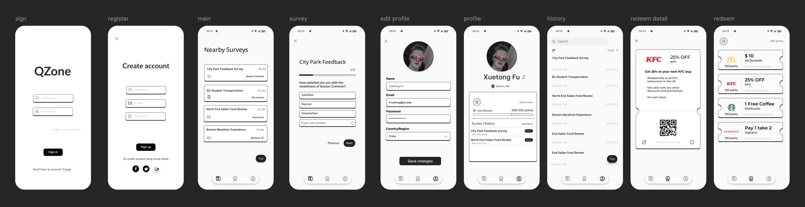

# QZone — Location-Based Survey App (Android, Kotlin)

> A mobile-first survey platform that uses **geo-targeting** and **rewards system** to boost response rate and sample diversity. Built with **Jetpack Compose + MVVM**.

---

## Team
\- **Yifei Bao** — Product & UX; user onboarding/auth; profile & basic recommendation design

\- **Xuetong Fu** — Survey engine & data; questionnaire flow; storage & submission

\- **Zhenyang Qian** — Location & geofencing; rewards/points; platform integrations

> As a collaborative team of three, we will share all design and architecture decisions. To ensure progress, we have assigned primary focus areas, but we will all contribute to the entire codebase through pair programming and code reviews.

---

## Project Description
**QZone** lets users discover and complete surveys tied to their **current location**. Users open the app to see nearby surveys, answer with a **modern multimedia interface**, and earn **points** upon completion.  
For creators (future web portal), QZone enables **precise geo-targeting** to collect diverse and context-relevant responses.

**Why now?** Existing tools (e.g., web forms) are clunky on mobile and lack location awareness or instant incentives, causing high drop-off and low engagement.

---

## MVP Features
* **Onboarding & Authentication:** Effortless user registration and login, including third-party support for Google, Meta, and X to minimize friction.
* **Location-Based Survey Feed:** Use the device's GPS to fetch and display a list of surveys relevant to the user's current area. This is the central feature of our app.

* **Reward & Points System:** Users earn a base number of points for every completed survey, with the potential for bonus points set by the survey creator.

* **Multimedia Survey Interface:** A native, intuitive interface for answering various question types, with support for embedded text, images, audio, and video content.

* **User Profile Management:** A section for users to manage basic information, such as their profile picture, region, and personal interests.

* **Modern & Personalized UI/UX:** Built with a focus on beauty and usability, ensuring a branded, consistent design.

**Stretch (if time allows)**: Map explore, profile-based matching, **shake-to-refresh** (gyroscope), in-app redemption placeholder, color-blind friendly theme.

---

## Tech Stack
- **External APIs:** Google Identity Services, Firebase Authentication / Firestore, Google Maps SDK for Android.
- **Onboard Sensors:** GPS / Network Location, Gyroscope, Camera API, Microphone API
- **Data Storage:** Proto DataStore(local data caching)

---

## UI Overview

