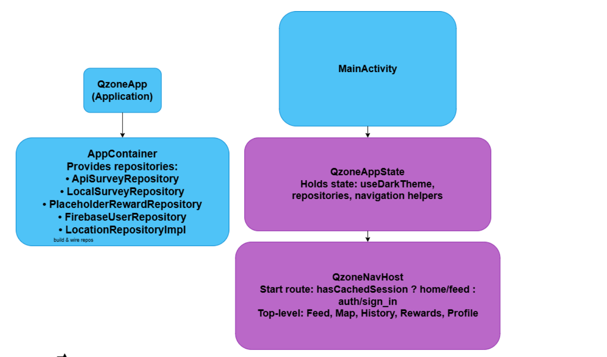
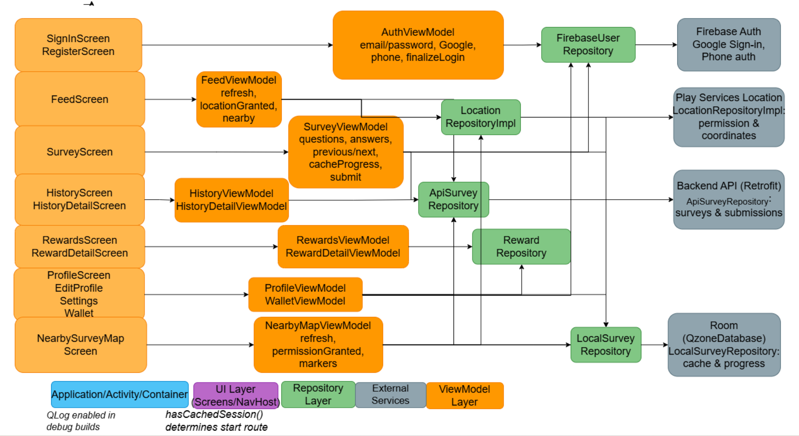
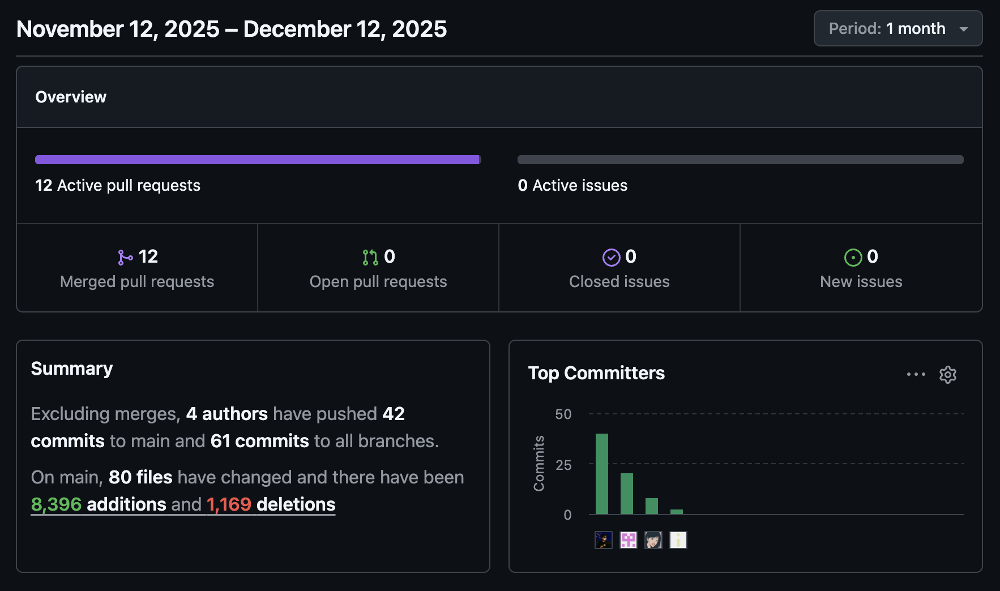
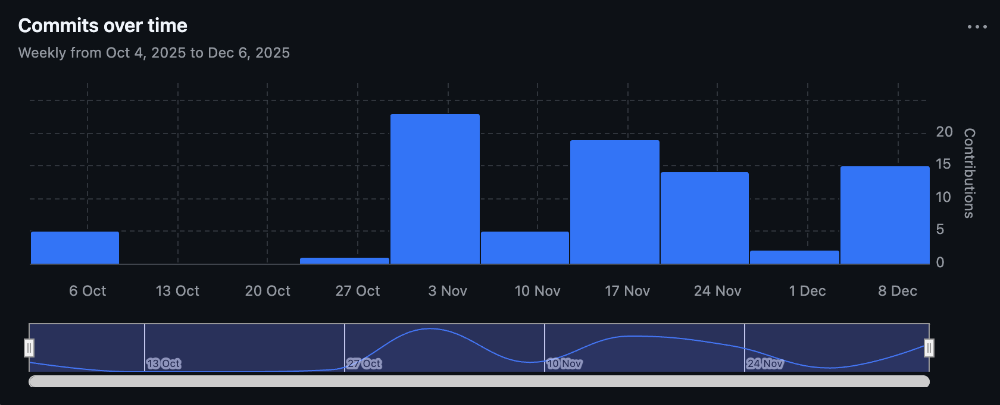

# QZone Final Report

## 1. Technical Implementation

### 1.1 Architecture

QZone follows a **clean MVVM architecture** with clear separation of concerns and unidirectional data flow. The architecture is organized into three main layers with explicit boundaries and well-defined responsibilities.

#### Architecture Layers

**UI Layer **

- **Location**: `feature/*/ui/` and `ui/components/`
- **Composition**: All screens built using Jetpack Compose with Material 3 design system
- **Screen Composables**: Feature-scoped composables like `FeedScreen`, `SurveyScreen`, `ProfileScreen`, `HistoryScreen`, `RewardsScreen`, `NearbySurveyMapScreen`
- **Reusable Components**: Shared UI components in `ui/components/`:
  - `SurveyCard`: Displays survey information with location, points, and progress
  - `QzoneElevatedSurface`: Custom elevated surface with consistent styling
  - `QzoneTag`: Tag component for displaying status and metadata
- **State Observation**: UI observes ViewModel state via `collectAsState()`:
  ```kotlin
  val uiState by viewModel.uiState.collectAsState()
  ```
- **Event Handling**: UI sends user actions to ViewModel through callback functions (e.g., `onSurveySelected`, `onAnswerChanged`)
- **Navigation**: Managed by Navigation Compose with type-safe routes (see Navigation Map below)

**ViewModel Layer**

- **Location**: `feature/*/` (e.g., `FeedViewModel`, `SurveyViewModel`, `ProfileViewModel`)
- **State Management**: Each ViewModel manages UI state using `MutableStateFlow<UiState>` exposed as immutable `StateFlow`
- **State Classes**: Dedicated data classes for each feature's UI state:
  - `FeedUiState`: surveys list, location status, loading/error states
  - `SurveyUiState`: current survey, question index, answers map, submission status
  - `ProfileUiState`: user profile, rewards, loading states
- **Unidirectional Flow**: User actions → ViewModel methods → state updates → UI recomposition
- **Coroutine Scope**: All async operations use `viewModelScope` for automatic cancellation
- **Repository Integration**: ViewModels depend on repository interfaces, not concrete implementations
- **Error Handling**: Errors captured and exposed via UI state (e.g., `errorMessage: String?`)

**Data Layer**
- **Repository Interfaces**: Defined in `domain/repository/`:
  - `SurveyRepository`: Survey data operations
  - `UserRepository`: User authentication and profile
  - `LocationRepository`: Location services
  - `RewardRepository`: Rewards and redemption
- **Repository Implementations**: In `data/repository/`:
  - `ApiSurveyRepository`: Backend API integration via Retrofit
  - `FirebaseUserRepository`: Firebase Authentication and user management
  - `LocalSurveyRepository`: Room database for offline caching
  - `LocationRepositoryImpl`: Google Play Services location APIs
  - `PlaceholderRewardRepository`: Mock data for rewards (temporary)
- **Network Layer**: 
  - `QzoneApiClient`: Retrofit service configuration with OkHttp interceptors
  - `QzoneApiService`: Retrofit interface defining all API endpoints
  - `AuthTokenProvider`: Centralized token management for authenticated requests
- **Local Storage**:
  - `QzoneDatabase`: Room database with DAOs for surveys, questions, options, locations
  - `UserLocalStorage`: SharedPreferences for user profile and token caching

**Dependency Injection**
- **AppContainer**: Lightweight service locator in `QzoneApp.onCreate()`
  ```kotlin
  container = AppContainer(
      surveyRepository = ApiSurveyRepository(),
      userRepository = FirebaseUserRepository(),
      locationRepository = LocationRepositoryImpl(this),
      localSurveyRepository = LocalSurveyRepository(database),
      ...
  )
  ```
- **ViewModel Factories**: Each ViewModel has a factory method that receives repositories
- **Navigation Integration**: `QzoneAppState` holds repositories and provides them to ViewModels via factories
- **No Heavy DI**: Avoids complex DI frameworks, keeping architecture simple and testable

#### Data Flow Architecture

**Unidirectional Data Flow Pattern:**
```
User Action (UI)
    ↓
ViewModel Method (e.g., onSurveySelected())
    ↓
Repository Call (e.g., surveyRepository.getSurveyById())
    ↓
Data Source (API/Database)
    ↓
Repository Returns Data
    ↓
ViewModel Updates StateFlow
    ↓
UI Observes StateFlow via collectAsState()
    ↓
Compose Recomposition
```

**Example Flow - Survey Submission:**
1. User taps "Submit" → `SurveyScreen` calls `onSubmit()` callback
2. `SurveyViewModel.submit()` validates answers and builds request
3. `SurveyRepository.submitResponses()` calls backend API via Retrofit
4. Backend returns success/error response
5. ViewModel updates `SurveyUiState` with result
6. UI recomposes to show success message or error

#### Navigation Architecture

The app uses Navigation Compose with a hierarchical navigation structure.

**Navigation Routes (Type-Safe)**

All routes defined in `QzoneDestinations` sealed class:

**Authentication Routes:**
- `auth/sign_in` - Sign in screen (start if no session)
- `auth/register` - Registration screen

**Top-Level Routes (Bottom Navigation):**
- `home/feed` - Feed screen (Home tab)
- `map/nearby` - Map screen (Map tab)
- `history` - History screen (History tab)
- `rewards` - Rewards screen (Rewards tab)
- `profile` - Profile screen (Profile tab)

**Detail Routes (Parameterized):**
- `survey/detail/{surveyId}` - Survey detail screen
- `history/completed/{surveyId}/{responseId}` - Completed survey detail
- `rewards/detail/{rewardId}` - Reward detail screen

**Profile Sub-routes:**
- `profile/edit` - Edit profile screen
- `profile/settings` - Profile settings screen
- `profile/wallet` - Wallet screen

**Navigation Flow Examples:**

1. **Authentication Flow:**
   ```
   SignIn → (success) → Feed
   SignIn → Register → (success) → Feed
   ```

2. **Survey Discovery Flow:**
   ```
   Feed → (tap survey) → SurveyDetail → (submit) → Feed
   NearbyMap → (tap marker) → SurveyDetail → (submit) → NearbyMap
   ```

3. **History Flow:**
   ```
   History → (tap in-progress) → SurveyDetail
   History → (tap completed) → HistoryDetail
   ```

4. **Profile Flow:**
   ```
   Profile → EditProfile → (save) → Profile
   Profile → ProfileSettings → (logout) → SignIn
   Profile → Wallet → (back) → Profile
   ```

**Navigation Implementation Details:**

- **Type-Safe Routes**: Routes defined as sealed class with `createRoute()` helper methods
- **Argument Passing**: Navigation arguments passed via route parameters (e.g., `surveyId`, `responseId`)
- **Back Stack Management**: 
  - Top-level destinations use `popUpTo(startDestination)` with `saveState = true`
  - Detail screens use `popBackStack()` to return
- **Bottom Bar Visibility**: Controlled by `isTopLevelDestination()` check
- **State Preservation**: Top-level destinations preserve state when navigating away and back
- **Deep Linking**: Routes support deep linking (structure allows for future implementation)

**Key Architectural Decisions:**
- **Unidirectional Data Flow**: Prevents state synchronization issues and makes app predictable
- **Repository Abstraction**: Enables easy testing with mock implementations and clean separation
- **StateFlow for State**: Ensures reactive UI updates without manual state management
- **Coroutines for Async**: Handles all async operations with proper error handling and cancellation
- **Type-Safe Navigation**: Compile-time safety prevents navigation errors
- **Feature-Based Organization**: Code organized by feature for better maintainability





### 1.2 API Integration

**Backend REST API**
- Custom Java backend integrated via Retrofit 2.11.0 with Moshi for JSON serialization
- `QzoneApiClient` configures OkHttp with `ApiCallLoggingInterceptor` for request/response logging
- All authenticated requests include `Authorization: Bearer {accessToken}` header via `AuthTokenProvider`
- Key endpoints:
  - `/api/user/login`, `/api/user/register` for authentication
  - `/api/user/third-party` for Google Sign-In
  - `/api/survey/{id}` for survey details
  - `/api/response/` for submitting answers
  - `/api/location/nearby` for location-based survey discovery
  - `/api/coupon/redeem` for reward redemption

**Firebase Authentication**
- `FirebaseUserRepository` handles email/password and Google Sign-In
- After Firebase authentication, exchanges Firebase ID token for backend access/refresh tokens
- Tokens cached locally using `UserLocalStorage` and refreshed automatically
- Session persistence enables auto-login on app restart

**Google Maps SDK**
- `NearbySurveyMapScreen` uses `maps-compose` library to display interactive map
- Shows user location and markers for nearby surveys
- Distance calculations and camera animations for better UX

**Sensor Integration**

**Accelerometer (Shake-to-Refresh)**
- `ShakeDetector` class implements `SensorEventListener` to monitor device acceleration
- Uses `SensorManager` with `TYPE_ACCELEROMETER` sensor type
- Threshold-based detection: 1500 m/s² acceleration threshold to trigger refresh
- Cooldown mechanism: 1500ms minimum time between shake triggers prevents spam
- Integrated in `FeedScreen` and `NearbySurveyMapScreen` using `DisposableEffect` for lifecycle management
- Automatically unregisters sensor listener when screen is disposed to prevent memory leaks
- Provides intuitive gesture-based refresh alternative to manual refresh buttons

**GPS/Location Sensors**
- `LocationRepositoryImpl` uses Google Play Services `FusedLocationProviderClient` for location services
- High-accuracy location requests with `Priority.PRIORITY_HIGH_ACCURACY`
- Handles multiple location sources: GPS, network, and passive location providers
- Automatic coordinate conversion: WGS-84 to GCJ-02 for accurate display in China (via `CoordinateConverter`)
- Reverse geocoding: Uses Android `Geocoder` to convert coordinates to human-readable addresses
- Permission management: Runtime permission requests with graceful fallback when denied
- Location validation: Checks for stale or inaccurate cached locations before use
- Error handling: Returns structured `LocationResult` (Success, PermissionDenied, LocationDisabled, Error)

**Error Handling**
- Network errors handled with `runCatching` and proper exception propagation
- User-friendly error messages displayed via UI state
- Offline fallback to cached data when network unavailable

### 1.3 Jetpack Compose Usage

**Material 3 Design System**
- Custom theme in `ui/theme/Theme.kt` with typography, color schemes, and shapes
- Supports light/dark modes with automatic system preference detection
- Dynamic color support on Android 12+ devices

**State-Driven Recomposition**
- UI automatically updates when ViewModel `StateFlow` emits new values
- Composables use `collectAsState()` to observe state changes
- Efficient recomposition only when necessary

**Navigation Compose**
- Type-safe navigation graph managed by `QzoneNavHost`
- Route definitions in `QzoneDestinations` prevent navigation errors
- Bottom navigation bar with Home, Map, History, Rewards, and Profile sections

**Responsive Layouts**
- Adaptive UI using `Column`, `Row`, `LazyColumn` for different screen sizes
- `LazyColumn` for scrollable lists with proper item keys
- Window insets handled via `WindowInsets.statusBars` for proper padding

**Composable Architecture**
- Feature-scoped composables with clear separation of concerns
- Reusable components for consistency across screens
- Each screen composable receives state and callbacks as parameters

### 1.4 Key Features

QZone provides a comprehensive location-based survey platform with the following core features:

- **Location-Based Survey Discovery**: GPS-powered feed automatically displays nearby surveys within a configurable radius (default 5km)
- **Interactive Survey Completion**: Multi-question surveys supporting single choice, multiple choice, and text input with progress tracking
- **Points & Rewards System**: Users earn points for completing surveys and can redeem them for rewards/coupons
- **Offline Support**: Room database caches surveys locally, enabling access without network connectivity
- **Interactive Map View**: Google Maps integration showing survey locations with markers and camera positioning
- **Shake-to-Refresh**: Accelerometer-based gesture detection for intuitive feed refresh
- **User Profile Management**: Profile editing, avatar upload, wallet view, and survey history tracking
- **Multiple Authentication Methods**: Email/password, Google OAuth, and phone number authentication via Firebase
- **Dark/Light Mode**: Material 3 design system with automatic theme switching and dynamic color support

## 2. Problem Definition and Solution

### 2.1 Problem

Traditional survey tools face critical limitations:
- **Poor mobile experience**: Web forms are clunky on smartphones, leading to high abandonment rates
- **Lack of location context**: Surveys cannot target users based on their current location
- **Low engagement**: No instant incentives or gamification, resulting in low response rates
- **Limited reach**: Static distribution methods fail to capture diverse, real-time responses

### 2.2 Solution

QZone addresses these problems through:
- **Mobile-native interface**: Built entirely with Jetpack Compose for smooth, responsive UI
- **Location-based discovery**: GPS-powered feed automatically fetches nearby surveys
- **Gamification**: Points system and rewards incentivize participation
- **Real-time targeting**: Backend API supports geo-targeted survey distribution

### 2.3 Challenges and Lessons Learned

**Challenge 1: Location Permission Handling**
- **Problem**: Users need to grant location permission, but the flow must be non-intrusive
- **Solution**: Implemented permission launcher with clear UI hints, graceful fallback to cached surveys
- **Lesson**: Always provide fallback options when requesting sensitive permissions

**Challenge 2: State Management in Compose**
- **Problem**: Complex state updates across multiple screens led to synchronization issues
- **Solution**: Adopted unidirectional data flow with StateFlow, ensuring single source of truth
- **Lesson**: Strict architectural patterns prevent state bugs in reactive UIs

**Challenge 3: Backend API Integration**
- **Problem**: Token management and refresh logic was complex
- **Solution**: Centralized token handling in `AuthTokenProvider` with automatic refresh
- **Lesson**: Abstracting infrastructure concerns (like auth) simplifies business logic

**Challenge 4: Offline Support**
- **Problem**: Users need access to surveys when network is unavailable
- **Solution**: Room database caches surveys locally, enabling offline access
- **Lesson**: Offline-first approach improves user experience significantly

## 3. Team Engagement and Process

### 3.1 Team Structure

**Xuetong Fu – Backend / API Integration**

*Primary Responsibilities: Backend API design, data persistence, location services, and map integration*

- **Backend API & Client**: Designed comprehensive REST API architecture and documentation (`API_DOCUMENTATION.md`). Implemented `QzoneApiClient` using Retrofit with Moshi, configured OkHttpClient with Bearer token interceptors, automatic token refresh, and 401 error handling.

- **Firebase Authentication**: Implemented Firebase token exchange mechanism in `FirebaseUserRepository`, supporting email/password, Google OAuth, and phone authentication. Built token management with local storage persistence and session refresh logic.

- **Room Database**: Designed Room schema with `SurveyEntity`, `SurveyQuestionEntity`, `SurveyOptionEntity`, `NearbyLocationEntity`. Implemented `LocalSurveyRepository` for offline caching of surveys, questions, options, and nearby locations.

- **Location Services**: Built `LocationRepositoryImpl` using FusedLocationProviderClient with permission handling, Geocoder integration for reverse geocoding, and `CoordinateConverter` utility for WGS-84 to GCJ-02 conversion in China.

- **Google Maps**: Integrated Google Maps SDK with Compose, implemented `NearbySurveyMapScreen` with interactive markers, camera positioning, and shake-to-refresh integration.

**Yifei Bao – Survey Engine & Rewards System**

*Primary Responsibilities: Survey completion flow, rewards system, sensor integration, and points calculation*

- **Survey Flow**: Built complete survey completion flow in `SurveyViewModel` with question navigation, progress tracking, and answer collection supporting single/multiple choice and text input. Integrated with backend API (`POST /api/survey/{surveyId}/submit`) and implemented points calculation.

- **Shake-to-Refresh**: Implemented `ShakeDetector` using accelerometer sensor with threshold (1500) and cooldown (1500ms), integrated in `FeedScreen` and `NearbySurveyMapScreen` with proper sensor lifecycle management.

- **Rewards System**: Built `RewardsViewModel` and `RewardDetailViewModel` for rewards catalog and details. Implemented redemption flow with points validation, integrated with backend API (`POST /api/reward/{rewardId}/redeem`), and built redemption history tracking.

- **Points Management**: Implemented points calculation logic, display in profile/wallet, balance updates after submission, and transaction history tracking.

- **Survey Repository**: Implemented `ApiSurveyRepository` with survey prefetching, caching strategy, and location-based filtering for nearby surveys.

**Zhenyang Qian – UI/UX Design & Account Management**

*Primary Responsibilities: Compose design system, navigation architecture, user profile management, and authentication UI*

- **Design System**: Created Material 3 design system (`ui/theme/Theme.kt`) with light/dark mode color schemes, `QzoneTypography`, `QzoneShapes`, and reusable components (`QzoneElevatedSurface`, `QzoneTag`, `SurveyCard`).

- **Navigation**: Designed type-safe navigation with `QzoneDestination` sealed class, built `QzoneNavHost` with hierarchical graph, implemented bottom navigation (Feed, Map, History, Rewards, Profile), and navigation state management with `QzoneAppState`.

- **Profile Management**: Implemented `ProfileScreen`, `ProfileViewModel`, `EditProfileScreen`, profile settings, and wallet screen. Integrated profile updates with backend API (`PUT /api/user/profile`).

- **Authentication**: Built `FirebaseUserRepository` and `AuthViewModel`, created `SignInScreen` and `RegisterScreen` with email/password and Google OAuth, implemented phone authentication, session management, and local storage persistence.

- **Avatar & History**: Implemented avatar upload with image picker and remote storage (`POST /api/user/upload-url`), built `HistoryScreen` with search functionality, `HistoryDetailScreen`, and `HistoryViewModel` with local database queries.

### 3.2 Collaboration Process

**Shared Responsibilities**
- All team members contributed to code reviews and architecture decisions
- Pair programming sessions for complex features (e.g., Firebase token exchange, navigation setup)
- Regular code reviews before merging pull requests
- Shared understanding of entire codebase through documentation and code walkthroughs
- Cross-functional contributions: Backend developer helped with Room database, UI developer assisted with API integration

**Communication**
- Regular team meetings to discuss progress and blockers
- GitHub issues for tracking tasks and bugs
- Pull request reviews for knowledge sharing
- Shared documentation in README, API_DOCUMENTATION.md, and code comments
- Real-time collaboration on architecture decisions via discussions

**Evidence of Collaboration**

- Multiple commits from each team member across different features
- Feature branches(like login, location, phone-login etc.) merged after team review
- Shared ownership of critical components (e.g., authentication flow, navigation)





### 3.3 Agile Practices

**GitHub Workflow**
- Feature branches for each major feature (e.g., `feature/survey-flow`, `feature/rewards-system`)
- Pull requests with descriptions, screenshots, and testing notes
- Code reviews before merging to main branch
- Issues for tracking bugs, enhancements, and technical debt
- Commit messages following conventional format for clarity

**Short Iterations**
- Weekly sprints with clear goals and deliverables
- Incremental feature development (e.g., authentication → feed → survey → rewards)
- Regular testing and integration after each feature completion
- Continuous improvement based on feedback and testing results
- Quick iterations allowed rapid adaptation to challenges

**Self-Organization**
- Team members chose their focus areas based on interests and skills
- Flexible task assignment based on availability and workload
- Collaborative problem-solving for complex issues (e.g., location permission flow)
- Shared ownership of code quality and architecture decisions
- Team-driven prioritization of features and bug fixes

## 4. AI Use in Development

### 4.1 Tools Used

- **GitHub Copilot**: Inline completions and chat inside Android Studio/VS Code for Kotlin/Compose.
- **ChatGPT**: Architectural reasoning, API usage comparisons, copy refinement.

### 4.2 What They Were Used For (Project-Specific)

**Code (UI)**: Drafted the Compose bottom-sheet map experience in `com.qzone.feature.feed.ui.FeedScreen` (the "View my location on map" chip, `MapViewContent`, markers, camera centering), then hand-tuned padding, shapes, and permission overlays. Also suggested copy for the location chips and map hints.

**Code (Logic)**: Assisted with permission + location flow in `FeedViewModel.refreshWithLocation` and `loadNearbyLocationsWithCoordinates` (guarding null/permission-denied cases, sequencing refresh before map). Helped adjust navigation wiring for location-enabled feed entry in `QzoneNavHost`.

**Refactors**: Proposed state hoisting and `remember`/`LaunchedEffect` usage for the map sheet and shake-to-refresh areas; trimmed unused imports and tightened nullability checks around `currentLocation` and nearby lists.

**Testing/Debug**: Used AI to reason through potential crashes when location permission is missing while opening the map sheet, and to add guards/fallback camera targets; asked AI for test ideas on permission denial, empty nearby list, and stale location to validate the feed/map behavior. AI suggestions were reviewed and only safe changes were applied.

**Documenting**: We use AI to write some of the documents. To quickly transform our ideas into structured text. And mostly used case is to translate our thoughts from Chinese to formatted English.

### 4.3 Where AI Was Helpful vs. Misleading

**Helpful**: Quick Compose scaffolds with sensible defaults (layout spacing, `remember` patterns), Retrofit/Flow wiring templates, sample permission request flows, and wording for UX hints. AI helped quickly understand code structure and logic, especially when reviewing other team members' modifications and changes. It also enabled rapid testing of initial ideas by generating prototype code that could be quickly validated before full implementation.

**Misleading/Pitfalls**: Suggested deprecated Compose APIs; location flows without runtime permission checks; examples that bypassed app logging (`QLog`) or our naming; overly generic network error handling that hid exceptions. CANNOT automatically resolve Git merge conflicts. Human review and manual conflict resolution are required before commit.

### 4.4 Review & Refactor Practices

**AI-generated block was manually reviewed, trimmed, or rewritten** to match Kotlin/Compose idioms (`remember`, `LaunchedEffect`, state hoisting) and project layering (UI → ViewModel → Repository).

**Security/Privacy**: Ensured location use stays minimal (no unnecessary persistence), kept permission gating, and avoided logging sensitive lat/lng beyond what was already in app logs; checked that map API keys stay in resources, not hardcoded.

**Quality**: Reran lint/compile after AI edits; removed dead parameters/imports; enforced nullability checks and default fallbacks; reworded UX strings to be specific and concise.

**Style**: Aligned with `QLog` usage, spacing/shape choices consistent with existing Compose styling; comments added only for non-obvious flows (e.g., permission gating in the map sheet).

